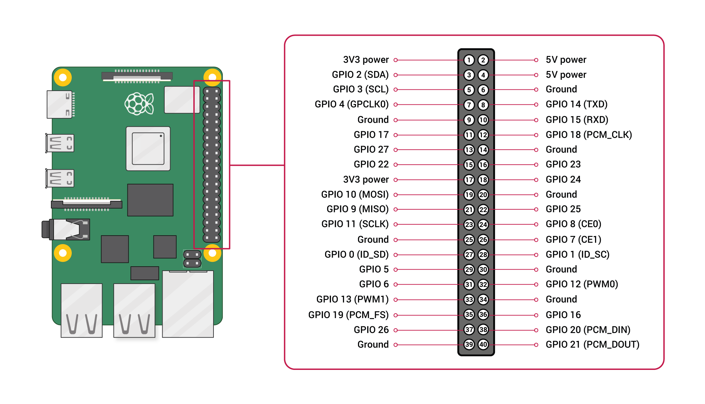

# *O*Authentic Physical Access Controller

## Purpose 

This project proposes an Open Source implementation of a *Physical Access Controller* based on the [*O*Authentic API](https://oauthentic.com/en/api.html) that takes care of user authentication and a [Raspberry 4](https://www.raspberrypi.org/products/raspberry-pi-4-model-b/) as a controller that is a connected to a relay in order to trigger an electric door lock or any other security system.

## Hardware components

The project is based on the following components:

- [Raspberry 4](https://www.raspberrypi.org/products/raspberry-pi-4-model-b/)
- 7-inch touch screen touch screen : Either the [official 800x480 screen](https://www.amazon.fr/Raspberry-Pi-2473872-Display-Schermo/dp/B014WKCFR4/) or an HDMI 1024x600 one that provides a better quality display
- Standard optocoupler relay for Raspberry or Arduino such as [this one](https://www.amazon.fr/Elegoo-Optocoupleur-%EF%BC%94-Channel-Arduino-Raspberry/dp/B06XKST8XC/)
  
You can use other components for this project (e.g. Raspberry 3, 5-inch screen, other model of relay) depending on your personal requirements. 
  
## Hardware installation

Follow the instructions of your hardware to get started with the motherboard and the screen. For the optocoupler, we just need to connect it to one the Raspberry GPIO pin such as in the following table:

| | Raspberry GPIO | optocoupler |
| -- | -- | -- |
| 5V power | pin 4 | VCC |
| Ground | pin 5 | Ground |
| IO port | pin 23 | relay 1 |

See below the Rasperry 4 GPIO description.

 
