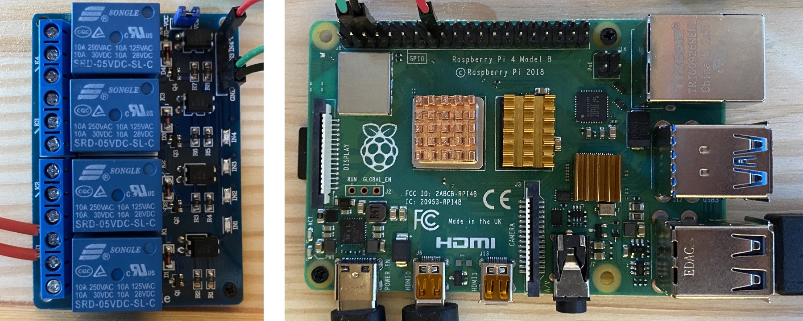

# *O*Authentic Physical Access Controller

## Purpose 

This project proposes an Open Source implementation of a *Physical Access Controller* based on the [*O*Authentic API](https://oauthentic.com/en/api.html) that takes care of user authentication and a [Raspberry 4](https://www.raspberrypi.org/products/raspberry-pi-4-model-b/) as a controller that is a connected to a relay in order to trigger an electric door lock or any other security system.

## Hardware

### Components

The project is based on the following components:

- [Raspberry 4](https://www.raspberrypi.org/products/raspberry-pi-4-model-b/)
- 7-inch touch screen touch screen : Either the [official 800x480 screen](https://www.amazon.fr/Raspberry-Pi-2473872-Display-Schermo/dp/B014WKCFR4/) or an HDMI 1024x600 one that provides a better quality display
- Standard optocoupler relay for Raspberry or Arduino such as [this one](https://www.amazon.fr/Elegoo-Optocoupleur-%EF%BC%94-Channel-Arduino-Raspberry/dp/B06XKST8XC/)
  
You can use other components for this project (e.g. Raspberry 3, 5-inch screen, other model of relay) depending on your personal requirements. 
  

### Installation

Follow the instructions of your hardware to get started with the motherboard and the screen. For the optocoupler, we just need to connect it to one the Raspberry GPIO pin such as in the following table that uses the GPIO port 23 to manage the first relay of the optocoupler:

| | Raspberry GPIO | optocoupler |
| -- | -- | -- |
| 5V power | pin 4 | VCC |
| Ground | pin 6 | Ground |
| IO port  | pin 15 | relay 1 |

### Raspberry 4 GPIO description 


### Hardware configuration of the *O*Authentic Controller
 


The relay can be used to trigger any equipment. For test and demo purpose, it is recommended to start with a simple lamp. When installed, the controller will be customizable from the [*O*Authentic Developer Dashboard](https://oauthentic.com/app/), including the relay triggering time.

## Software

### Architecture


The controller is composed of two modules:

- the client module is an HTML/CSS/JavaScript app that runs in the default Chromium browser and that takes care of (1) user interface, (2) controller logic and (3) communications with :
	- the *O*Authentic API server: [https://api.oauthentic.com](https://oauthentic.com/en/api.html),
	- the local server.

- the local Nodejs HTTP server module takes care of interactions with Raspberry hardware (system, gpio...). 

### Installation

#### Start with a fresh config

This installation process assumes that the hardware has been installed with:

- the latest [Raspberry Pi OS](https://www.raspberrypi.org/downloads/raspberry-pi-os/) distribution,
- the X-Window destop enabled,
- the Chromium browser installed,
- an Ethernet or WLAN connection to Internet.

 If not, please update your system with the [latest packages](https://www.raspberrypi.org/documentation/raspbian/updating.md) and  consider [raspi-config](https://www.raspberrypi.org/documentation/configuration/raspi-config.md) to configure your system.


#### Install Nodejs

Nodejs is required for the local server module. It has been tested with version 12. See installation process below.

```
# Install latest Node.js (version 12 here) and check version
curl -sL https://deb.nodesource.com/setup_12.x | sudo -E bash -
sudo apt-get install -y nodejs
node -v
```  

#### Install Arial fonts

By default Arial fonts are not provided in Raspberry, but we need them for the client module.

```
# MS corefont are required for UX visual alignement whatever the underlying system
sudo apt-get install ttf-mscorefonts-installer
sudo fc-cache
sudo fc-list
```

#### Clone this repository to your Raspberry

You can clone the [controller repo](https://github.com/oauthentic/controller) where your want in your Raspberry user filesystem. For the REST of the documentation, we'll assume it is install at the path `~/CONTROLLER`.

#### Install the required packages for the Nodejs server

```
cd ~/CONTROLLER/server
npm install
```

#### Start controller

From command line, please customize the following script with your path and run it.

```
#!/bin/bash

# Script to start OAuthentic controller on Raspberry 4
# 1. Kill Nodejs and Chromium former processes if any
pkill -f nodejs
pkill -f chromium

# 2. Launch Nodejs server
cd ~/CONTROLLER/server
nohup node index.js >/dev/null 2>&1 &

# 3. Launch HTML client with Chrome in display 0 and following parameters:
#     --noerrdialogs • Suppresses all error dialogs when present
#     --kiosk • Enable kiosk mode.
#     --start-fullscreen • Specifies if the browser should start in fullscreen mode.
#     --disable-pinch • Diseable pinch gesture
#     --enable-logging=stderr --v=0 • Log with minimul info to retrieve console.log
#     --use-gl=osmesa • Disable GPU-accelerated compositing
# Source: https://peter.sh/experiments/chromium-command-line-switches/
cd ~/CONTROLLER/client
DISPLAY=:0 chromium-browser --noerrdialogs --kiosk --start-fullscreen --disable-pinch --use-gl=osmesa --enable-logging=stderr --v=0 index.html >/dev/null 2>&1 &

```

#### Stop controller

```
#!/bin/bash

# Kill Nodejs and Chromium former processes if any
pkill -f nodejs
pkill -f chromium
```

## First launch

By default, the controller is not defined in *O*Authentic database, then its first launch will define it on server side.

### Step 1: Network checking

If your system is well connected, this step is skipped.

### Step 2: Localization

In the current version English and French are supported. Just touch the screen to select one of them

### Step 3 : Configuration

To define your controller on *O*Authentic server with default parameters, you just have to scan the installation QR-code displayed on your Raspberry screen with your well configured  *O*Authentic mobile app. 

When done, your controller will appear in the *Developper Dashboard* of the [*O*Authentic web app](https://oauthentic.com/app/) where you will be able :

- to customize its user interface and triggering time,
- to define the users who will be accepted by your controller,
- to view its access control log.


### Step 4 : Run

That's it! Your controller is now running and next time you'll restart it will be up and running.

## Further launches

After the initial configuration, the controller is operational at each launch.

If you change the controller configuration from Developper Dashboard when the controller is running, the new configuration will be automatically taken into account by the controller after the next access control. No need to reboot the Raspberry.

It's your turn to play and to send me comments and suggestions for improvements.

Thanks

Guillaume DORBES